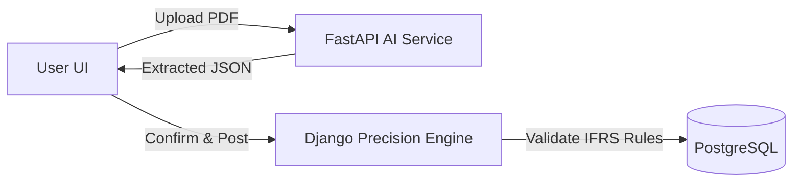

# Autobooks Frontend: AI-Powered Precision Accounting

This Next.js application serves as the user-facing dashboard for Autobooks, a specialized financial system that combines Generative AI with rigorous accounting standards. It acts as the orchestration layer between two distinct backend services:

1. **Perception Layer (Autobooks AI)**: Handles OCR and semantic understanding of unstructured documents (invoices, receipts).
2. **Domain Logic Gate (Precision Engine)**: Enforces IFRS for SMEs standards, validating double-entry logic before any transaction is committed to the ledger.

## Key Features

- **Smart Document Ingestion**: Upload invoices or receipts directly via the UI. The system uses a hybrid OCR engine (EasyOCR + Vertex AI) to extract vendors, dates, and totals.
- **Automated Double-Entry**: The UI displays the AI's suggested transaction, which is mapped to strict IFRS Account Codes (e.g., Trade Receivables vs. Revenue) by the backend engine.
- **Financial Copilot (RAG)**: A "Business Copilot" chat interface that allows users to ask questions like "How is my cash flow?". The system injects real-time P&L and Balance Sheet data into the LLM context for accurate answers.
- **Real-Time Reporting**: View dynamically generated Balance Sheets and Profit & Loss statements that pass the accounting equation check (Assets = Liabilities + Equity).

## Architecture Overview

The UI facilitates a "Gatekeeper" workflow to ensure data integrity:



- **Ingest**: User uploads a file. The AI Service extracts text and intent.
- **Map**: The Precision Engine identifies the correct Debit/Credit accounts based on document type.
- **Validate**: The engine enforces IFRS rules (e.g., non-negative constraints).
- **Post**: Only valid, balanced transactions are saved to the ledger.

## Tech Stack

| Component          | Technology                          | Purpose                                      |
|--------------------|-------------------------------------|----------------------------------------------|
| Frontend           | Next.js 14, React, Tailwind CSS    | Reactive dashboard and state management.    |
| AI Integration     | REST API (FastAPI)                 | Connects to the OCR & Vertex AI pipeline.   |
| Accounting Core    | REST API (Django/DRF)              | Connects to the IFRS Logic Gate and Ledger. |
| Auth               | JWT                                | Secure session management.                   |

## Installation & Setup

### Prerequisites

- Node.js (v18+)
- Running instance of Autobooks AI (FastAPI)
- Running instance of Autobooks Backend (Django)

### Steps

1. **Clone the Repository**
   ```bash
   git clone https://github.com/Nick-Maximillien/autobooks-frontend.git
   cd autobooks-ui
   ```

2. **Install Dependencies**
   ```bash
   npm install
   # or
   yarn install
   ```

3. **Configure Environment**

   Create a `.env.local` file in the root directory:

   ```bash
   # Point to your FastAPI AI Service
   NEXT_PUBLIC_AI_SERVICE_URL=http://localhost:8001

   # Point to your Django Accounting Engine
   NEXT_PUBLIC_ACCOUNTING_ENGINE_URL=http://localhost:8000

   # Authentication (if applicable)
   NEXT_PUBLIC_AUTH_DOMAIN=...
   ```

4. **Run Development Server**
   ```bash
   npm run dev
   ```

   Open [http://localhost:3000](http://localhost:3000) to view the dashboard.

## Project Structure

```
src/
├── components/
│   ├── dashboard/     # Financial charts and widgets
│   ├── upload/        # File dropzone for AI ingestion
│   └── copilot/       # RAG Chat interface
├── pages/
│   ├── reports/       # Balance Sheet & PnL views
│   └── ledger/        # Transaction history
├── services/
│   ├── aiService.ts   # Connects to FastAPI (OCR/Copilot)
│   └── ledgerService.ts # Connects to Django (IFRS Validation)
└── utils/             # Formatting for currency and dates
```


## License

MIT License.
